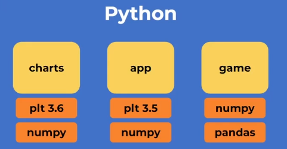
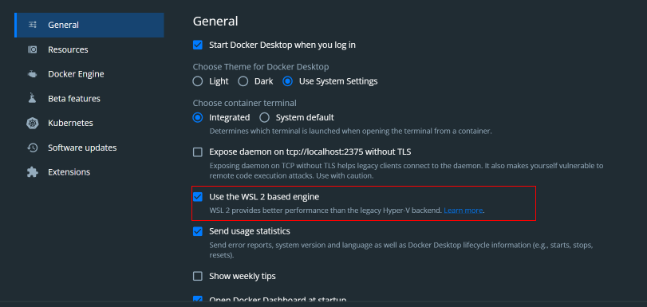
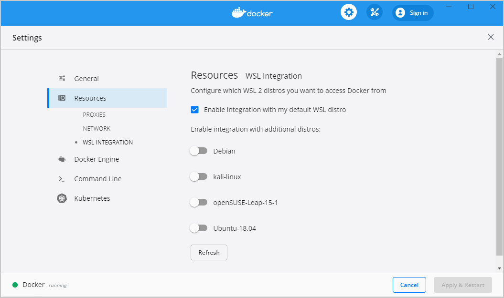

# ****Curso de Python**: PIP y Entornos Virtuales**

# 1. Introducción

* 1. ## Python en tu propio entorno de desarrollo local

El objetivo de es crear y usar un entorno profesional de Python, gestionando dependencias y entornos virtuales.

* Comandos básicos en la terminal Unix.
    * **pwd**: Indica en qué ubicación estamos
    * **mkdir**: Crear una nueva carpeta
    * **ls**: Lista de archivos
    * **cd**: Nos permite abrir una carpeta
    * **clear**: Nos permite despejar la terminal
    * **git init**: Inicializar
    * **touch**: Crear archivos
* Otros comandos
    * **rm**: sirve para borrar archivos
    * **rmdir**: sirve para borrar directorios
    * **mv**: sirve para mover directorios
    * **df**: indica el espacio en disco, el disponible, usado y total

[Clase](https://platzi.com/home/clases/4261-python-pip/55120-python-en-tu-propio-entorno-de-desarrollo-local/)

2. ## Instalación en Windows (WSL) y Linux

Al igual que con cualquier lenguaje de programación serio, Python admite bibliotecas y marcos de terceros que puede instalar para evitar tener que reinventar la rueda con cada nuevo proyecto. Puede encontrarlos en un repositorio central llamado "PyPI" (Python Package Index).

Pero descargar, instalar y administrar estos paquetes a mano puede ser frustrante y llevar mucho tiempo, por lo que muchos desarrolladores de Python confían en una herramienta especial llamada PIP para que Python haga todo mucho más fácil y rápido.

¿Qué es PIP para Python?

PIP es un acrónimo que significa "Paquetes de instalación PIP" o "Programa de instalación preferida o Preferred Installer Program". Es una utilidad de línea de comandos que le permite instalar, reinstalar o desinstalar paquetes PyPI con un comando simple y directo: "pip".

Si alguna vez ha realizado algún trabajo de línea de comandos en Windows (con el símbolo del sistema) o Mac o Linux (con el Terminal y Bash), entonces te sentirás como en casa y puedes ir directamente a las instrucciones de instalación para su particular sistema operativo.

¿Se instala PIP con Python?
Si está utilizando Python 2.7.9 (o superior) o Python 3.4 (o superior), entonces PIP viene instalado con Python por defecto. Si está utilizando una versión anterior de Python, deberá seguir los pasos de instalación que se detallan a continuación. De lo contrario, salte a la parte inferior para aprender cómo comenzar a usar PIP.

Si está ejecutando Python en un entorno virtual creado con virtualenv o pyvenv, entonces PIP estará disponible para ese entorno independientemente de la versión de Python.

Comandos

    python | python3 --> ejecuta python, si no esta instalado lo instala
    exit() --> para salir de la interfaz de python
    python -V --> ver la version de python
    pip -V --> ver version de pip

[Clase](https://platzi.com/home/clases/4261-python-pip/55122-instalacion-en-windows-wsl-y-linux/)

* 3. ## Instalación en Mac

Comandos utilizados

* python o python3
* exit()

Normalmente viene instalado en Mac, en caso de que no lo tenga continuar con estos comandos 

Herramientas de codigo

* sudo xcode-select --install
* sudo xcode-select --reset

* brew install python3 --> Instalación de python
* python3  Verificar la Instalación

[Clase](https://platzi.com/home/clases/4261-python-pip/55123-instalacion-en-mac/)

* 4. ## Python con VSCode

Vamos a utilizar el editor de código más utilizado en este momento: Visual Studio Code.

Es un editor liviano en el cual podemos instalar extensiones a medida que necesitemos.

Extensiones a instalar:
1. Python
2. WSL (Windows Subsystem for Linux)

* 5. ## Python con Git y GitHub

* 6. ## Flujo de trabajo en Python

Para ejecutar un script de Python:

```bash
python script.py
```

En un repositorio en GitHub en el **README.md** debemos explicar **que es** el proyecto y **como ejecutarlo**. Documentar el proyecto.

* 7. ## ¿Qué es PIP?

Una de las cosas más interesantes de Python es su ecosistema de frameworks y librerías, que podemos usar para crear nuestros proyectos, así no reinventar la rueda para solucionar ciertos problemas en específico.

Todos estos paquetes los encontramos de forma pública en PyPI (Python Package Index)

**PIP: Preferred Installer Program**. Es una utilidad de línea de comandos que le permite instalar, reinstalar o desinstalar paquetes PyPI con un comando simple y directo: "pip".

    pip -V --> verificamos tener pip, que version

**PyPI** : https://pypi.org/
    
* Aca podemos buscar los paquetes, entrar y ver como se instalan. Suele ser de la forma:

        pip install package_name

Por ejemplo *matplotlib*: es una biblioteca integral para crear visualizaciones estáticas, animadas e interactivas en Python. Se instala:

    pip install matplotlib

### Comandos PIP

    pip freeze -> vemos los paquetes instalados en el entorno global de Python

* 8. ## Gráficas en Python con PIP

* 9. ## ¿Qué es un entorno virtual?

Instalar a nivel global puede causar distintos problemas al momento de manejar diferentes proyectos, por ejemplo para algunos proyectos necesitaras otro tipo de version, libreria o modulos y para solucionar esto se creo un ambiente virtual en python el cual encapsula cada proyecto y no lo deja de forma compartida.



### **¿Qué es un entorno virtual en Python?**

Un entorno virtual (o ambiente virtual) en el contexto de Python es una herramienta que te permite **crear un espacio aislado** en tu sistema donde puedes **instalar paquetes y dependencias de Python sin afectar** el entorno global de Python en tu máquina.

### Beneficios de los entornos virtuales:

* **Aislamiento**: Cada entorno virtual es independiente y aísla las bibliotecas y paquetes que instalas en él.
* **Gestión de dependencias**: Facilita la especificación de dependencias necesarias para tu proyecto en un archivo requirements.txt.
* **Evitar conflictos**: Previene que las bibliotecas de un proyecto afecten a otros proyectos o al entorno global de Python.
* **Limpieza y organización**: Permite una gestión ordenada y eliminación de entornos virtuales no utilizados.

* 10. ## Usando entornos virtuales en Python

**READ** --> https://docs.python.org/3/library/venv.html

Para crear un entorno virtual ejecutamos el comando

    #              (venv_directory) --> contendra todo el venv
    python -m venv venv

Ahora tenemos que activar el ambiente

    source ./venv/Scripts/activate

Ahora podemos ver con ```pip freeze``` que no hay librerias instaladas y con which python que apunta al venv.
Tenemos un entorno aislado.

Para salir del ambiente virtual ejecutamos

    deactivate

* 11. ## requeriments.txt

El archivo requeriments.txt en un proyecto contiene las dependencias del proyecto y que versiones de estas dependencias.

Para crear este archivo:

    pip freeze > requeriments.txt

Para instalar la lista de dependencias:

    pip install -r requeriments.txt

* 12. ## Solicitudes HTTP con Requests

Una de las librerías mas usadas de Python es:

* **Requests**

    Se encarga de hacer peticiones a otro tipo de servidores web desde Python.

Empezamos un proyecto nuevo que consultará APIs llamado web-server.

1. Creamos el directorio:
        
        mkdir web-server

2. Creamos el entorno virtual y lo activamos:

        python -m venv venv
        source ./venv/Scripts/activate

3. Chequeamos que el proyecto quedo aislado y listo para empezar a instalar dependencias:

        pip freeze

4. Instalamos las dependencias necesarias:

        pip install requests

5. Listamos las dependencias en un archivo para mejorar la documentacióny divulgación del proyecto.

        pip freeze > requeriments.txt

6. No olvides hacer todo esto con un sistema de control de versiones como Git y documentar el proyecto.

* 13. ## Pandas

Pandas es una **librería para el análisis y manipulación de datos** de archivos duros como .csv.

https://pandas.pydata.org/

https://platzi.com/cursos/pandas-numpy/

* 14. ## Python para Backend: web server con FastAPI

Framework para creación de APIs

        pip install fastapi

Servidor web para mantener online la API

        pip install "uvicorn[standard]"

* 15. ## ¿Qué es Docker?


Docker es un proyecto de código abierto que automatiza el despliegue de aplicaciones dentro de contenedores de software, proporcionando una capa adicional de abstracción y automatización de virtualización de aplicaciones en múltiples sistemas operativos. Docker utiliza características de aislamiento de recursos del kernel Linux, tales como cgroups y espacios de nombres (namespaces) para permitir que "contenedores" independientes se ejecuten dentro de una sola instancia de Linux, evitando la sobrecarga de iniciar y mantener máquinas virtuales.

El soporte del kernel Linux para los espacios de nombres aísla la vista que tiene una aplicación de su entorno operativo, incluyendo árboles de proceso, red, ID de usuario y sistemas de archivos montados, mientras que los cgroups del kernel proporcionan aislamiento de recursos, incluyendo la CPU, la memoria, el bloque de E/S y de la red. Desde la versión 0.9, Docker incluye la biblioteca libcontainer como su propia manera de utilizar directamente las facilidades de virtualización que ofrece el kernel Linux, además de utilizar las interfaces abstraídas de virtualización mediante libvirt, LXC (Linux Containers) y systemd-nspawn.

Docker implementa una API de alto nivel para proporcionar contenedores livianos que ejecutan procesos de manera aislada.

Construido sobre las facilidades proporcionadas por el kernel Linux (principalmente cgroups y namespaces), un contenedor Docker, a diferencia de una máquina virtual, no requiere incluir un sistema operativo independiente. En su lugar, se basa en las funcionalidades del kernel y utiliza el aislamiento de recursos (CPU, la memoria, el bloque E / S, red, etc.) y namespaces separados para aislar la vista de una aplicación del sistema operativo. Docker accede a la virtualización del kernel Linux ya sea directamente a través de la biblioteca libcontainer (disponible desde Docker 0.9), o indirectamente a través de libvirt, LXC o systemd-nspawn.

Mediante el uso de contenedores, los recursos pueden ser aislados, los servicios restringidos, y se otorga a los procesos la capacidad de tener una visión casi completamente privada del sistema operativo con su propio identificador de espacio de proceso, la estructura del sistema de archivos, y las interfaces de red. Contenedores múltiples comparten el mismo núcleo, pero cada contenedor puede ser restringido a utilizar solo una cantidad definida de recursos como CPU, memoria y E / S.

Usar Docker para crear y gestionar contenedores puede simplificar la creación de sistemas altamente distribuidos, permitiendo que múltiples aplicaciones, las tareas de los trabajadores y otros procesos funcionen de forma autónoma en una única máquina física o en varias máquinas virtuales.

* Ejemplo de Docker

Supongamos que estás trabajando en un proyecto de aplicación web con un equipo de desarrolladores. Cada desarrollador tiene su propia computadora y cada uno está utilizando un sistema operativo diferente (Windows, MacOS o Linux). Además, cada uno de ellos tiene diferentes versiones de las herramientas y bibliotecas necesarias para desarrollar la aplicación.

Con Docker, puedes crear un contenedor que incluya todo lo necesario para ejecutar la aplicación, incluyendo el código, las herramientas y las bibliotecas. Luego, cada desarrollador puede ejecutar la aplicación en su propia computadora simplemente instalando Docker y ejecutando el contenedor. De esta manera, cada uno de los desarrolladores puede trabajar en el mismo entorno, sin importar el sistema operativo o las herramientas que tenga instaladas.

Cuando esté lista para desplegar la aplicación en producción, puedes subir el contenedor a un repositorio de Docker y luego ejecutarlo en cualquier servidor que tenga Docker instalado. De esta manera, puedes asegurarte de que la aplicación funcione de la misma manera en todos los entornos, desde el desarrollo hasta la producción.

* 16. ## Intalación de Docker

Según el sistema operativo que utilices puede variar la instalación, así que a continuación te daré las indicaciones base para la instalación según tu sistema operativo:

### Instalación en Windows con WSL (Recomendada) 🐧

Debes descargar el instalador desde la página de [Docker for Windows](https://docs.docker.com/desktop/install/windows-install/).

Cuando ya tienes instalado Docker Desktop dentro de tus programas debes abrirlo y debes asegurarte que la opción “Use the WSL 2 based engine” está habilitada:



Luego en la sección “Resources > WSL Integration”, asegurarate que la opcion “Enable integration with my default WSL distro”, este habilitada:



Puedes ver más detalles de Docker con WLS 👉 [Docker Desktop WSL 2 backend](https://docs.docker.com/desktop/windows/wsl/)

### Instalación en Windows 🪟

Debes descargar el instalador desde la página de [Docker for Windows](https://docs.docker.com/desktop/install/windows-install/)

Cuando ya tienes instalado Docker Desktop dentro de tus programas, una de las cosas que debes tener en cuenta en la instalación con Windows es que debes contar con Windows 10 de 64 Bits o superior y debes habilitar el Hyper-V de Windows.

Si quieres conocer los detalles, aquí te dejo el detalle como habilitar Hyper-V desde la Interfaz de Windows

Hyper-V

### Instalación en macOS 🍎

En Mac tienes dos opciones. Todo dependerá si tienes los nuevos chips M1 o Intel, ya que hay un instalable apropiado para ambas arquitecturas de chip. Puedes escoger el instalable desde Install Docker Desktop on Mac.

Adicionalmente, si cuentas con los nuevos chips M1, debes ejecutar la siguiente instrucción en tu terminal softwareupdate --install-rosetta

Una vez descargues el instalador adecuado, solo debes seguir los pasos y pasar Docker Desktop a tus aplicaciones.

drag
Instalación en Ubuntu 🐧
Estos son los pasos para instalarlo dentro de Ubuntu, sin embargo, también puedes ver directamente Install Docker Engine on Ubuntu

sudo apt-get update
sudo apt-get install \
    ca-certificates \
    curl \
    gnupg \
    lsb-release
sudo mkdir -p /etc/apt/keyrings
curl -fsSL https://download.docker.com/linux/ubuntu/gpg | sudo gpg --dearmor -o /etc/apt/keyrings/docker.gpg
echo \
  "deb [arch=$(dpkg --print-architecture) signed-by=/etc/apt/keyrings/docker.gpg] https://download.docker.com/linux/ubuntu \
  $(lsb_release -cs) stable" | sudo tee /etc/apt/sources.list.d/docker.list > /dev/null
sudo apt-get update
sudo apt-get install docker-ce docker-ce-cli containerd.io docker-compose-plugin
sudo docker run hello-world

* 17. ## Dockerizando Scripts de Python

Dockerfile para Scripts de Python sin servidor web:

```Dockerfile
FROM python:3.9

WORKDIR /app

COPY requeriments.txt /app/requeriments.txt

RUN pip install --no-cache-dir --upgrade -r /app/requeriments.txt

COPY . /app/
```

¿Cómo vamos a ejecutar este contenedor?

Para esto vamos a ayudarnos de un archivo .yml, que va a declarar, cómo y desde donde se iniciará el contenedor.

```yml
services:
  app-csv:
    build:
      context: .
      dockerfile: Dockerfile
```

**Cómo utilizar docker:**

Con docker instalado y abierto ejecutamos los siguientes comandos:

Buildeamos el container.

        docker-compose build

Lo ejecutamos

        docker-compose up -d

Vemos su status

        docker-compose ps

Para apagar el contenedor

        docker-compose down

Como ingresar al container para desarrollar desde allí:

        docker-compose exec service_name bash

Para salir del contenedor

        exit

